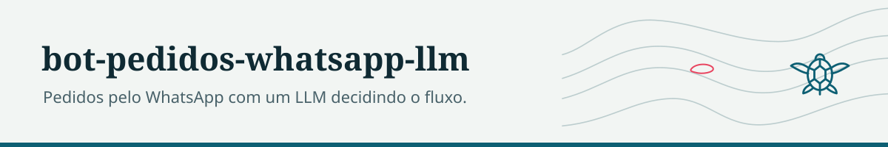
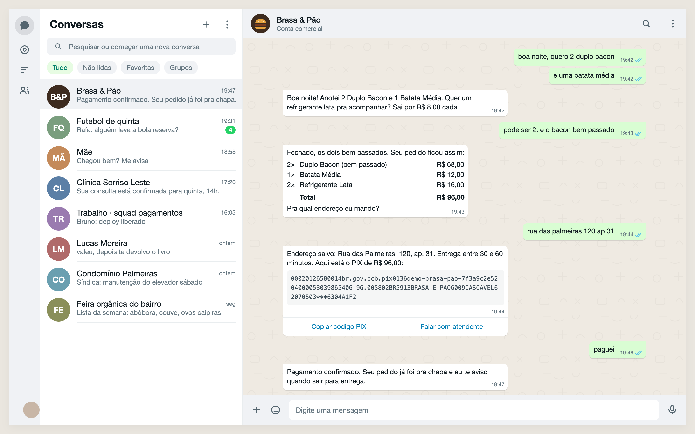
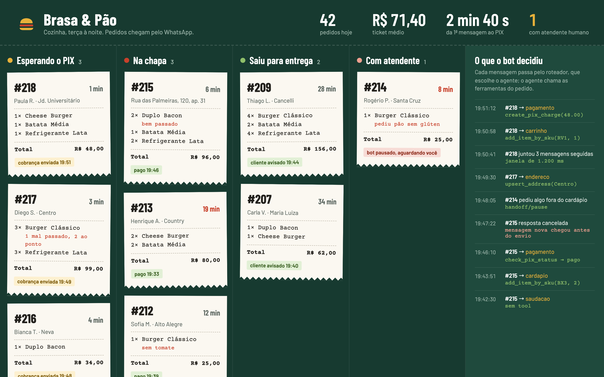

<picture>
  <source media="(prefers-color-scheme: dark)" srcset="docs/marca/cabecalho-escuro.svg">
  
</picture>

# bot-pedidos-whatsapp-llm

Bot de pedidos para lanchonete pelo WhatsApp em que um LLM decide o fluxo: um roteador escolhe o agente (saudação, cardápio, carrinho, endereço, pagamento) e cada agente conversa e chama ferramentas tipadas para mexer no pedido. Inclui agrupamento de mensagens picadas, transbordo para atendimento humano e um endpoint para testar sem a API da Meta.





*Dados fictícios. O painel é um desenho de como a cozinha acompanharia os pedidos e o que o roteador decidiu; o repositório ainda não tem front.*

## Por que existe

Pequeno negócio que vende pelo WhatsApp perde pedido por demora e bagunça na conversa. A ideia foi testar um desenho LLM-first: o código cuida de estado, persistência e regras; o texto e a escolha do próximo passo ficam com o modelo, guiados por prompts com objetivo, políticas e exemplos.

## Arquitetura

```
src/hamburgueria_bot/
  api/          Flask: webhook da Meta, /simulate, /handoff, /admin/reload-config, /healthz
  adk/          orquestrador (roteador LLM), agentes e registro de tools
  core/         configuração, DI (kink), logging JSON, PromptBuilder (Jinja2), cliente LLM, coalescência
  domain/       serviços puros de cardápio e carrinho
  repo/         modelos SQLAlchemy 2.0: inbox, outbox, estado da conversa, eventos
  connectors/   adaptador da WhatsApp Cloud API (com verificação de assinatura)
  tasks/        dispatcher do outbox
config/catalog.json   cardápio e regras, injetados como resumo nos prompts
```

Fluxo de uma mensagem:

1. Webhook (ou `/simulate`) grava a mensagem no inbox e checa se o contato está em transbordo.
2. Coalescência: espera uma janela de inatividade (`HB_COALESCE_WINDOW_MS`, padrão 1200 ms, máximo 3x) e junta mensagens seguidas do mesmo contato. A exclusão mútua usa advisory lock do Postgres, sem Redis.
3. O roteador LLM escolhe o agente com base nas últimas mensagens, no contexto e nas tools de cada agente.
4. O agente responde e pode chamar tools validadas por Pydantic (`add_to_cart`, `upsert_address`, `create_pix_charge`, ...). O pagamento PIX é simulado.
5. A resposta vai para o outbox. Antes de enviar, o dispatcher confere se chegou mensagem nova depois do pacote; se chegou, cancela o envio para não responder algo desatualizado.

Cada etapa registra evento em `conversation_events` com `trace_id`.

## Stack

Python 3.11, Flask, SQLAlchemy 2.0, Alembic, Postgres, Pydantic v2 e pydantic-settings, kink (DI), Jinja2, structlog, httpx. O LLM é chamado por um gateway compatível com a API da OpenAI (LiteLLM Proxy).

## Como rodar

```bash
cp .env.example .env          # token do WhatsApp, URL do gateway LLM e modelo
docker compose up --build     # Postgres + API na porta 8000
```

Testar sem WhatsApp:

```bash
curl -X POST http://localhost:8000/simulate \
  -H "Content-Type: application/json" \
  -d '{"wa_id": "teste-1", "text": "quero 2 x-bacon"}'
```

Transbordo humano: `POST /handoff/pause` e `POST /handoff/resume` com `{"wa_id": "..."}`.

## Testes

Não há suíte de testes automatizados.

## Status

MVP interrompido. Em 10/2026 foram corrigidos erros de indentação que impediam a importação de três módulos e adicionado o ponto de entrada da API. Ainda falta uma correção estrutural antes de subir: os agentes são instanciados no import e consultam o container de DI antes de `bootstrap_di()` registrar o cliente LLM. Também ficaram para depois a migração Alembic das tabelas de eventos, validação de endereço e um endpoint administrativo para aprovar pagamentos.

## Licença

MIT.
